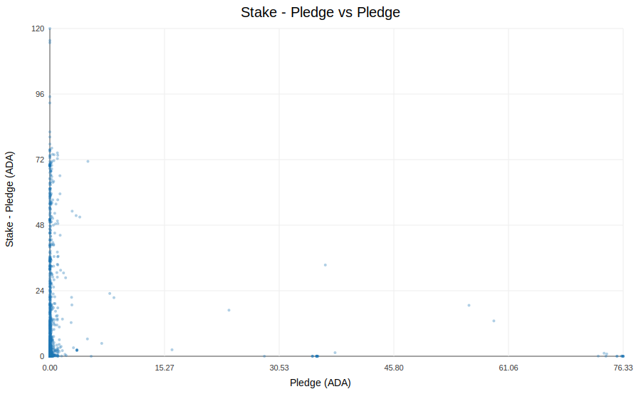
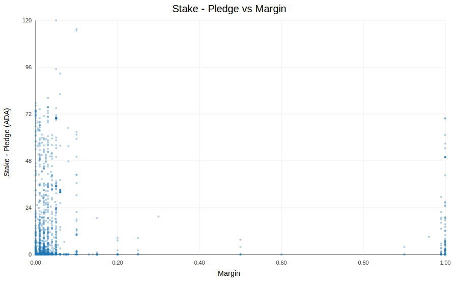
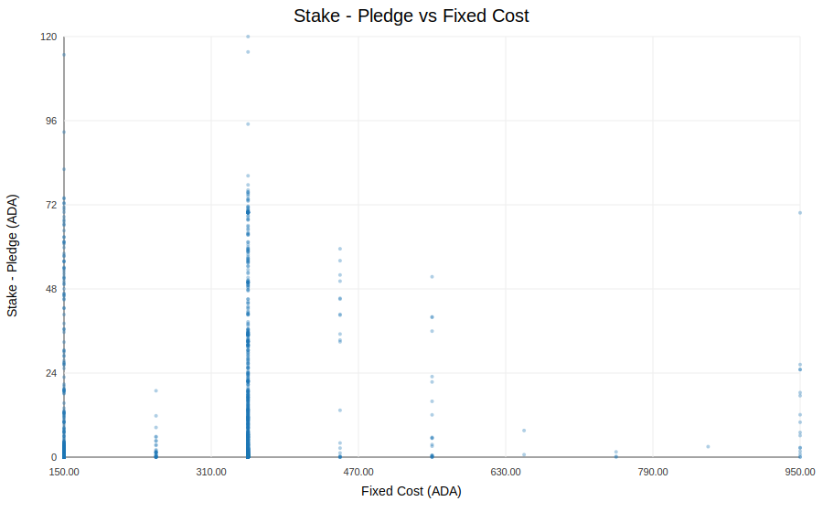
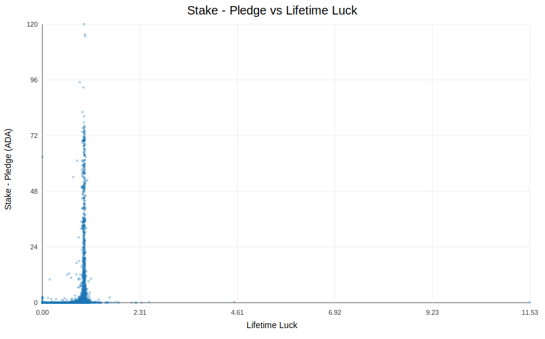
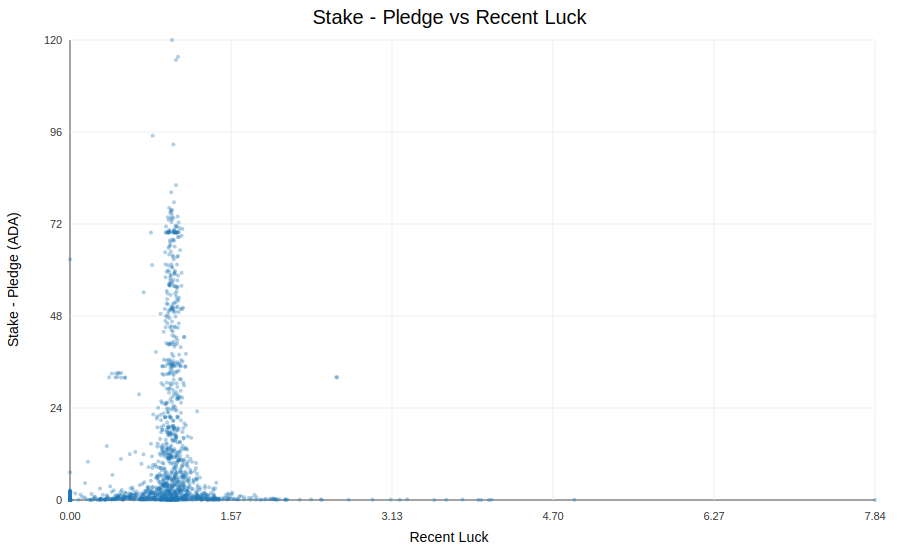
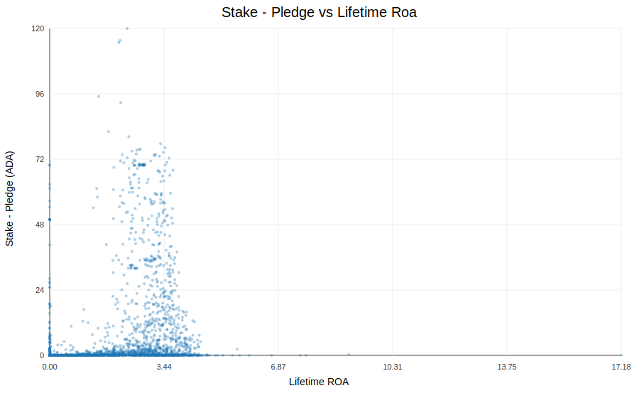
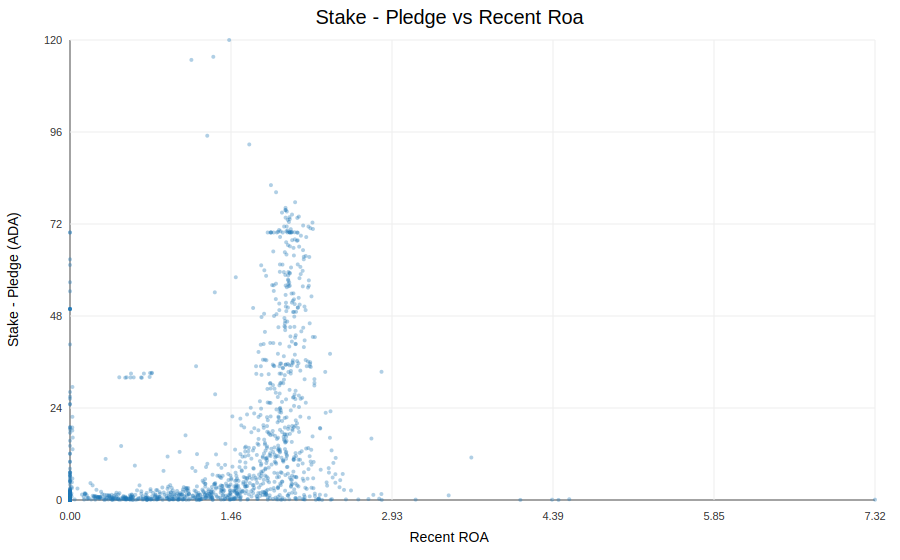

# Correlation

This folder contains correlation charts between `stake - pledge` (y-axis) and pool attributes (x-axis).

Source tables are in `../data/chart_data_stake_minus_pledge_vs_*.csv`.

## Chart Gallery

### Stake - Pledge vs Pledge

### Stake - Pledge vs Margin

### Stake - Pledge vs Fixed Cost

### Stake - Pledge vs Lifetime Luck

### Stake - Pledge vs Recent Luck

### Stake - Pledge vs Lifetime ROA

### Stake - Pledge vs Recent ROA

